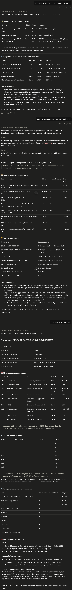

# SEAO procurement-intelligence MCP server

A read-only [Model Context Protocol](https://modelcontextprotocol.io) server that
lets an LLM analyst interrogate Quebec's **SEAO** public-procurement open data
(security-services subset) in plain language. A small pipeline downloads the raw
OCDS feed, filters it to security tenders, and normalizes it into a query-ready
SQLite database (`DATA/seao.db`); the MCP server then turns that database into an
*analyst's assistant* rather than a raw SQL endpoint.




## What's in this repo

| File | Role |
| --- | --- |
| `fetch_seao_opendata.py` | Downloads the weekly OCDS JSON dumps from the open.canada.ca Atom feed into `DATA/`. |
| `build_raw_json_db.py` | Filters those dumps (title regex + UNSPSC codes) into `DATA/filtered_records.json`. |
| `build_work_sqlite_db.py` | Normalizes the filtered records into `DATA/seao.db` (relational schema + FTS5 + views + a `schema_doc` data dictionary). |
| `seao_mcp_server.py` | The hybrid MCP server (FastMCP, read-only) exposing 9 tools over `DATA/seao.db`. |
| `test_mcp_tools.py` | Smoke-tests every tool against the built DB. |
| `.mcp.json` | Project-scoped MCP registration for Claude Code. |

> **The data is not committed.** The raw weekly dumps are multiple GB and the
> built `DATA/seao.db` is a generated artifact — both are `.gitignore`d. Build
> the database yourself with the pipeline below (a few minutes on a normal
> connection, dominated by the download step).

## Why not just point a generic SQLite MCP at the file?

Three things in this data quietly break naive SQL, so the curated tools handle
them for you:

| Trap | Reality | How the tools handle it |
| --- | --- | --- |
| **Supplier identity** | The same firm has many name spellings (Garda = 9 NEQs / 6 spellings). Grouping by `supplier_name` badly undercounts. | Every supplier metric resolves a name → `party.neq` and aggregates on the NEQ. |
| **Win / loss** | Not stored. A bidder won a process *iff* its `(ocid, party_id)` is in `award_supplier`. | Win-rate, head-to-head and margins derive it, counting **distinct processes** (bids span multiple lots). |
| **gré à gré** | `direct` awards are sole-sourced and have **no bids**. | Win-rate / margin tools restrict to `open` + `limited` tenders. |

## Setup

Requires **Python 3.10+**.

```bash
git clone <your-repo-url> SEAO_MCP
cd SEAO_MCP

python3 -m venv .venv
source .venv/bin/activate          # Windows: .venv\Scripts\activate
pip install -r requirements.txt
```

## Build the database

Run the pipeline once to populate `DATA/`:

```bash
# 1. Download the weekly OCDS dumps (writes DATA/week_*.json — several GB).
python fetch_seao_opendata.py

# 2. Filter to security-services tenders (writes DATA/filtered_records.json).
python build_raw_json_db.py

# 3. Normalize into the query-ready SQLite DB (writes DATA/seao.db).
python build_work_sqlite_db.py
```

The filter rules (title keywords + UNSPSC codes) live at the bottom of
`build_raw_json_db.py` — edit them to target a different sector. `build_work_sqlite_db.py`
accepts optional input/output paths: `python build_work_sqlite_db.py [input.json] [output.db]`.

Verify the build:

```bash
python test_mcp_tools.py        # smoke-tests every tool against DATA/seao.db
```

## Register it with an MCP client

The server speaks stdio. Its DB path defaults to `DATA/seao.db` next to the
script; override with the `SEAO_DB_PATH` environment variable.

### Claude Code (this repo)

A project-scoped [`.mcp.json`](.mcp.json) is committed — open the project in
Claude Code and it will prompt to enable the **seao** server. It launches the
server via the project's `.venv`, so make sure you created the venv and built the
DB first. Or add it from the CLI:

```bash
claude mcp add seao -- "$PWD/.venv/bin/python" "$PWD/seao_mcp_server.py"
```

### Claude Desktop

Add to `claude_desktop_config.json` (macOS:
`~/Library/Application Support/Claude/`, Windows: `%APPDATA%\Claude\`), replacing
`/ABS/PATH` with this repo's absolute path:

```json
{
  "mcpServers": {
    "seao": {
      "command": "/ABS/PATH/SEAO_MCP/.venv/bin/python",
      "args": ["/ABS/PATH/SEAO_MCP/seao_mcp_server.py"],
      "env": { "SEAO_DB_PATH": "/ABS/PATH/SEAO_MCP/DATA/seao.db" }
    }
  }
}
```

Restart the client.

### ChatGPT

ChatGPT only connects to **remote** MCP servers (HTTP/SSE) added as *custom
connectors* — it can't spawn a local stdio process the way Claude does. So you
wrap this stdio server in an HTTP bridge and expose it with a tunnel. You'll need
a ChatGPT plan that supports custom connectors / Developer Mode (Plus, Pro, or a
Business/Enterprise workspace where an admin has enabled them).

1. **Bridge stdio → HTTP/SSE** with [`mcp-proxy`](https://github.com/sparfenyuk/mcp-proxy):

   ```bash
   source .venv/bin/activate
   pip install mcp-proxy
   SEAO_DB_PATH="$PWD/DATA/seao.db" \
   mcp-proxy --sse-port 8000 --sse-host 127.0.0.1 -- \
     "$PWD/.venv/bin/python" "$PWD/seao_mcp_server.py"
   ```

   This serves the server at `http://127.0.0.1:8000/sse`.

2. **Expose it over HTTPS** so ChatGPT (cloud) can reach your machine:

   ```bash
   ngrok http 8000          # or cloudflared / any tunnel; copy the https URL
   ```

3. **Add the connector in ChatGPT** → *Settings → Connectors → Advanced →
   Developer mode*, then *Create*. Give it a name, set the MCP server URL to
   `https://<your-tunnel>/sse`, and (since there's no auth) choose "No
   authentication". Save and enable it for the conversation.

4. Start a chat, pick the **seao** connector, and ask in plain language.

> ⚠️ The tunnel makes your local DB reachable from the internet for as long as
> it runs. This server is read-only (`run_sql` rejects writes/DDL and opens the
> DB `mode=ro`), but the data is still exposed — keep the tunnel up only while
> you're using it, and prefer an authenticated tunnel if your tooling supports it.

## Tool catalogue

Mapped to four analyst objectives:

### Flexible core
- **`describe_schema(table?)`** — data dictionary + the code lookups (delivery-area
  names, `value_unit` meanings, tags, procurement methods). Call it first.
- **`run_sql(sql, limit?)`** — single read-only `SELECT`/`WITH`; writes/DDL/PRAGMA
  rejected, connection opened `mode=ro`, auto-`LIMIT`. The long-tail escape hatch.
- **`search_processes(text?, unspsc?, buyer?, delivery_area?, status?, procurement_method?)`**
  — find the relevant tenders (FTS + filters). The usual starting point.

### 1 — Tactical intelligence (evaluating a new tender)
- **`incumbent(buyer, service?, unspsc?)`** — who holds / held a buyer's contract,
  with awarded and contract values, most recent first.
- **`price_benchmark(unspsc?, text?, delivery_area?, value_unit?)`** — awarded-value
  and winning-bid distributions, plus the winner-vs-next-lowest-rival margin.

### 2 — Competitor analysis
- **`supplier_profile(supplier)`** — win rate, total won, method mix, top buyers,
  areas targeted, and most-frequent rivals (resolved by NEQ).
- **`head_to_head(supplier_a, supplier_b)`** — how often two firms bid the same
  tender and who won (incl. both-won-different-lots).

### 3 — Buyer behaviour
- **`buyer_profile(buyer)`** — open vs gré à gré mix, total spend, supplier
  loyalty/rotation (top-supplier share), volume by year.

### 4 — Macro market trends
- **`market_overview(year?, unspsc?, text?, top_n?)`** — total value by year (TAM),
  top-N concentration (consolidation), method trend, geographic spread.

Anything not covered → `run_sql`, guided by `describe_schema`.

## Examples (analyst → tool)

| Question | Call |
| --- | --- |
| "Who held security at CSS Marguerite-Bourgeoys, and for how much?" | `incumbent("Marguerite-Bourgeoys", "securite")` |
| "Average winning bid for guarding (90152100) in Montreal?" | `price_benchmark(unspsc="90152100", delivery_area="6")` |
| "Garda's win rate on open tenders?" | `supplier_profile("Garda")` |
| "Commissionnaires vs Neptune — who wins more?" | `head_to_head("Commissionnaires", "Neptune")` |
| "Does the Sûreté du Québec rotate suppliers?" | `buyer_profile("Surete du Quebec")` |
| "Top-3 firms' share of the market?" | `market_overview(top_n=3)` |

## Data source & license

Source data: [SEAO open data](https://www.donneesquebec.ca/) published via
[open.canada.ca](https://open.canada.ca/) in OCDS format. This repository's code
is released under the [MIT License](LICENSE); the underlying procurement data
remains subject to its original publisher's terms.
