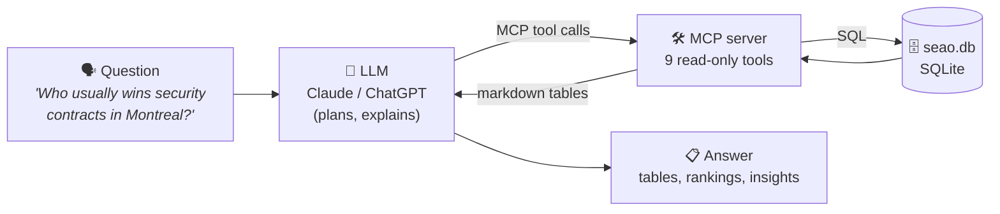
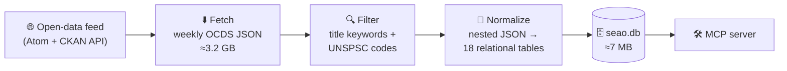
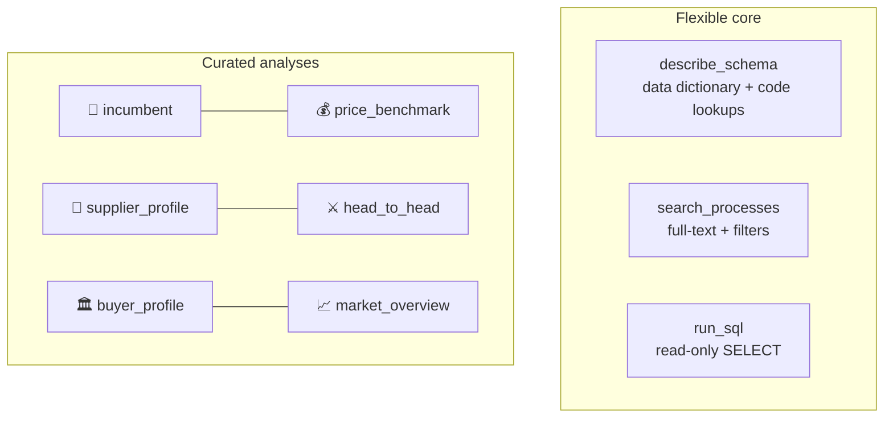
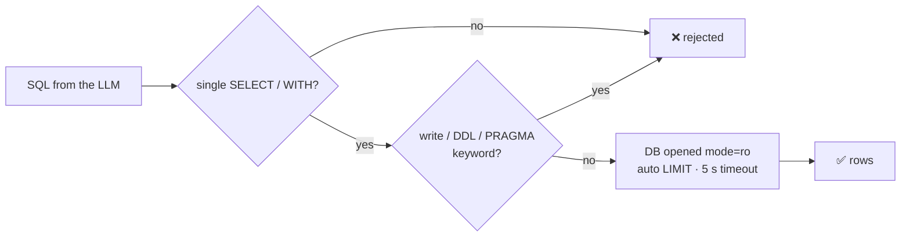

# SEAO Procurement Intelligence (MCP server/tool for Claude/GPT)

> **In one sentence:** you ask a question about Quebec's public security contracts in plain language ("Who held security at the Sûreté du Québec?", "What is Garda's win rate?"), an LLM like Claude or ChatGPT calls a set of analysis tools over a cleaned database of official procurement data, and you get a sourced answer with tables.

*A full example of chat (in french) with Claude is available at the end of this file*

---

## 1. The big picture



**MCP** (Model Context Protocol) is the open standard that lets an AI assistant call external tools. This project is the server side: it turns a public dataset into tools an assistant can use, and the tools do the counting so the LLM does not have to guess.

**Who it is for:** a company (or an analyst) that wants to answer business questions about public tenders without writing SQL, e.g. pricing a bid, sizing up a competitor, or understanding a buyer.

---

## 2. The data

| | |
|---|---|
| Source | **SEAO**, Quebec's official public-tendering system, published as open data on open.canada.ca |
| Format | OCDS (Open Contracting Data Standard), nested JSON, one file per week |
| Raw volume | 267 weekly files, ≈3.2 GB |
| Scope kept | **Security services**: guarding, security agencies, patrols (fire-safety tenders excluded) |
| After filtering | **1,785 procurement processes**, 336 public buyers, 480 distinct suppliers, 3,674 bids, 1,950 awards, 1,299 contracts |
| Period | 2008–2026, but 75% of processes fall in 2021–2025 |
| Currency | CAD |

---
*Of course adapting filters is necessary if you want to study another different domain instead of security services but the tool should work same*

## 3. The pipeline, step by step



| Step | Script | What it does |
|---|---|---|
| Fetch | `fetch_seao_opendata.py` | Reads the government Atom feed and downloads only new or updated weekly files |
| Filter | `build_raw_json_db.py` | Keeps a tender if its title matches security keywords (*gardiennage, agents de sécurité, patrouille…*) or its product code (UNSPSC) is a security code; removes duplicates |
| Normalize | `build_work_sqlite_db.py` | Flattens the nested JSON into tables (process, tender, lot, bid, award, supplier, contract, amendment…), adds a French full-text index, 5 summary views and a built-in data dictionary |

The build uses only Python's standard library. Changing the keyword list at the bottom of `build_raw_json_db.py` points the whole project at another sector.

### Cleaning the raw data

Government open data is messy. The build step fixes this before anyone queries the data:

| Problem in the raw data | Fix |
|---|---|
| Same field spelled differently across years (`NEQ`/`neq`, `totalAmount`/`totalamount`, `durationInDay`/`durationInDays`) | Read every known spelling into one column |
| Party IDs only unique inside one tender | Key every party on (tender, party) |
| French accents ("Sûreté" vs "Surete") | Accent-insensitive search |
| Codes stored as bare numbers (region `6`, unit `7`) | Lookup tables served to the LLM ("6 = Montréal", "7 = hourly rate") |

---

## 4. Why not just give the LLM raw SQL access?

This is the main design decision. A plain SQL connection lets the LLM write queries that run without errors and still give wrong answers. Three traps in this dataset cause that:

| Trap | What a naive query does | What the tools do |
|---|---|---|
| **One company, many names** | Groups by name. Garda appears under **9 business numbers and 6 spellings**, so its results are split into small pieces | Resolve any name to the official Quebec business number (**NEQ**) and add up all of them |
| **Wins are not stored** | Finds no "won" column, or guesses | Derives it: a bidder won if it appears among that tender's awarded suppliers, counted once per tender even when the tender has several lots |
| **Sole-source contracts** | Counts direct awards (*gré à gré*) in win rates, though nobody else could bid | Computes win rates and price margins on competitive tenders only (open and limited) |

These rules are also written into the server's instructions, so the LLM reads them before it writes any query of its own.

---

## 5. The tools

A **hybrid** design: 3 flexible tools for any question, plus 6 ready-made analyses that apply the rules above.



| Business question | Tool | Returns |
|---|---|---|
| *Who holds this buyer's contract today?* | `incumbent` | Current and past winners, contract values, most recent first |
| *What price should we bid?* | `price_benchmark` | Distribution of winning bids and the gap between the winner and the next-lowest bidder |
| *How strong is this competitor?* | `supplier_profile` | Win rate, total won, top clients, regions, most frequent rivals |
| *Us vs them?* | `head_to_head` | How often two firms bid on the same tender and who won |
| *How does this buyer behave?* | `buyer_profile` | Open vs sole-source mix, spending, whether it keeps the same supplier or rotates |
| *How big is the market and who leads it?* | `market_overview` | Value per year, top-N market share, regional spread |
| Anything else | `run_sql` | Any read-only query, guided by `describe_schema` |

Example output, `supplier_profile("Garda")`:

```
# Supplier profile: GROUPE DE SÉCURITÉ GARDA SENC
matched 9 NEQs (aggregated together)
- Awards won (all methods): 341 across 320 processes, total 623,281,730 $
- Competitive win rate (open+limited): 21.9% (51 won / 233 bid on)
Most frequent rival bidders:
- NEPTUNE SECURITY SERVICES INC.: co-bid 108x, rival won 55
- TRIMAX SÉCURITÉ INC.: co-bid 54x, rival won 15
```

---

## 6. Safety

The server is **read-only**:



- The database file is opened in read-only mode, so even a query that got past the checks could not modify it.
- Results are capped (automatic `LIMIT`), and any query running longer than 5 seconds is stopped.

---

## 7. Works with

| Client | How |
|---|---|
| **Claude Code** | `.mcp.json` is in the repo, so the server is offered as soon as the project is opened |
| **Claude Desktop** | One entry in `claude_desktop_config.json` |
| **ChatGPT** | Through an HTTP bridge (`mcp-proxy`) and a tunnel, added as a custom connector |

---

## 8. Stack and numbers at a glance

| Layer | Tech |
|---|---|
| Data acquisition | `requests`, Atom/XML parsing, CKAN API |
| Storage | SQLite: 18 tables, FTS5 full-text index, 5 views, data dictionary |
| Server | Python, MCP SDK (FastMCP), stdio transport |
| Testing | Smoke test that runs every tool on real analyst questions (`test_mcp_tools.py`) |

| | |
|---|---|
| Raw data → database | 3.2 GB of JSON → 7 MB SQLite |
| Coverage | 1,785 processes · 336 buyers · 480 suppliers |
| Full smoke test (all 9 tools) | ≈0.3 s |
| Runtime dependencies | 2 (`mcp`, `requests`) |

## Known limits

- **Coverage is partial:** SEAO's open data only reaches back reliably to about 2021. Older contracts are sparse, so figures are indicative, not exhaustive.
- **The filter decides the scope.** A security tender with an unusual title and no security product code will be missed.

## Example
